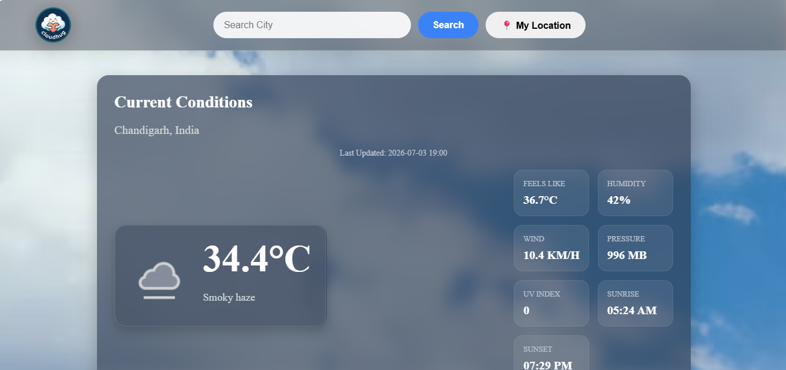
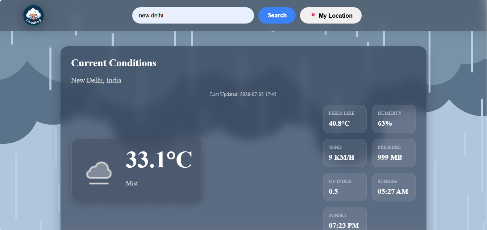
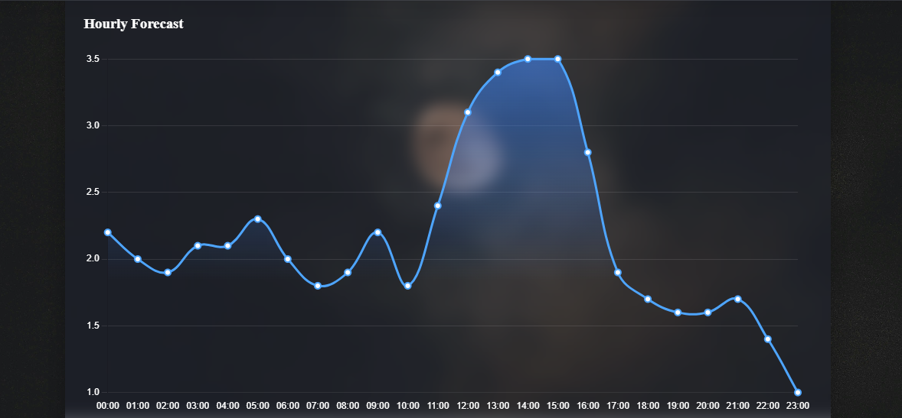
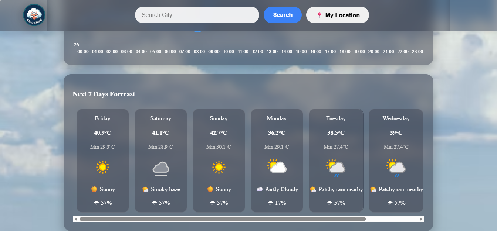

# ☁️ CloudHug

> **A modern weather forecasting web application with dynamic backgrounds, interactive charts, and location-based weather updates.**

CloudHug is a responsive weather application built using **HTML, CSS, and JavaScript**. It provides real-time weather information for any city in the world and automatically detects the user's current location to display local weather.

---

## ✨ Features

### 🌍 Weather Search
- Search weather by city name
- Instant weather updates
- Keyboard Enter support

### 📍 Current Location
- Detects your current location using the Geolocation API
- Displays weather without manually entering a city

### 🌡️ Current Weather
- Current temperature
- Weather condition
- Feels Like temperature
- Humidity
- Wind Speed
- Air Pressure
- UV Index
- Sunrise & Sunset
- Last Updated time

### 📅 7-Day Forecast
- Daily maximum & minimum temperatures
- Weather icons
- Rain probability
- Weather descriptions

### 📊 Hourly Forecast
- Beautiful temperature chart using Chart.js
- Smooth animations
- Interactive visualization

### 🎨 Dynamic User Interface
- Glassmorphism design
- Dynamic background images based on weather conditions
- Automatic Day/Night background switching
- Smooth animations
- Responsive layout (desktop optimized)

---

## 🛠️ Built With

- HTML5
- CSS3
- JavaScript (ES6)
- Chart.js
- WeatherAPI

---

## 📷 Screenshots

### Home Page



### Search Result



### Hourly Forecast



### 7-Day Forecast



---

## 🚀 How to Run

1. Clone the repository

```bash
git clone https://github.com/yogeshdudi111-spec/cloudhug.git
```

2. Open the project folder.

3. Open `index.html` in your browser.

---

## 📁 Project Structure

```
cloudHug/
│
├── index.html
├── style.css
├── script.js
├── logo.png
├── weather.png
├── cloudy.jpg
├── sunny.png
├── rain.jpg
├── snow.png
├── night.jpg
└── README.md
```

---

## 🔮 Future Improvements

- 🌐 Multiple language support
- 🌡️ Celsius/Fahrenheit toggle
- ❤️ Favorite cities
- 🌙 Dark/Light theme
- 🗺️ Weather map integration
- 📈 Air Quality Index (AQI)
- 🔔 Weather alerts

---

## 👨‍💻 Developer

**Yogesh Dudi**

GitHub: https://github.com/yogeshdudi111-spec

---

## ⭐ Support

If you like this project, consider giving it a ⭐ on GitHub.